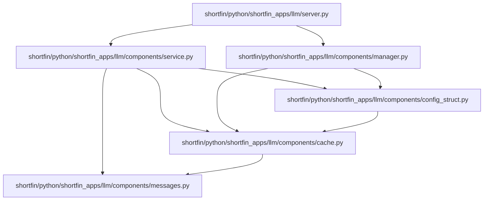

# Shortfin KV Cache Implementation

## Entrypoint and Dependency Trace

1. shortfin/python/shortfin_apps/llm/server.py (Entrypoint)
   - Imports SystemManager and GenerateService
   - SystemManager likely initializes the model and its components

2. shortfin/python/shortfin_apps/llm/components/service.py
   - Contains GenerateService class
   - Probably uses the KV cache during text generation

3. shortfin/python/shortfin_apps/llm/components/config_struct.py
   - Defines ModelParams and PagedKVCacheParams
   - Configures the KV cache parameters

4. shortfin/python/shortfin_apps/llm/components/cache.py
   - Implements AttnPageCache and AttnPageEntry
   - Manages the actual KV cache pages and their allocation/deallocation

5. shortfin/python/shortfin_apps/llm/components/messages.py
   - Implements InferenceExecRequest
   - Manages KV cache pages at the request level

## Mermaid Dependency Graph



## Key Components

### 1. shortfin/python/shortfin_apps/llm/server.py (Entrypoint)
- Imports:
  ```python
  from .components.manager import SystemManager
  from .components.service import GenerateService
  ```
- Likely initializes the system and starts the generation service

### 2. shortfin/python/shortfin_apps/llm/components/service.py (GenerateService)
- Probably contains the main logic for text generation
- Utilizes the KV cache during the generation process

### 3. shortfin/python/shortfin_apps/llm/components/config_struct.py
- Defines `PagedKVCacheParams`:
  ```python
  @dataclass
  class PagedKVCacheParams:
      block_seq_stride: int
      device_block_count: int
  ```
- Defines `ModelParams`:
  ```python
  @dataclass
  class ModelParams:
      # ... other parameters ...
      paged_kv_cache: PagedKVCacheParams | None = None
      attn_dtype: sfnp.DType = sfnp.float16
  ```

### 4. shortfin/python/shortfin_apps/llm/components/cache.py
- Implements `AttnPageEntry`:
  ```python
  class AttnPageEntry:
      def __init__(self, cache: "AttnPageCache", index: int):
          self.cache = cache
          self.index = index
          self.in_use = False
  ```
- Implements `AttnPageCache`:
  ```python
  class AttnPageCache:
      def __init__(self, *, devices: Sequence[sf.ScopedDevice], model_params: ModelParams):
          # Initialize page tables and management structures

      def acquire_free_pages(self, count: int) -> list[AttnPageEntry] | None:
          # Acquire free pages for use

      def release_pages(self, pages: list[AttnPageEntry]):
          # Release pages back to the free pool
  ```

### 5. shortfin/python/shortfin_apps/llm/components/messages.py
- Defines `InferencePhase` enum:
  ```python
  class InferencePhase(Enum):
      PREFILL = 1
      DECODE = 2
  ```
- Implements `InferenceExecRequest`:
  ```python
  class InferenceExecRequest(sf.Message):
      def __init__(self, phase: InferencePhase, input_token_ids: list[int]):
          # Initialize request attributes

      def cache_page_indices(self, max_len: int) -> list[int]:
          # Return indices of locked cache pages

      def free_cache_pages(self):
          # Release locked cache pages

      def lock_initial_cache_pages(self, cache: AttnPageCache, pages: list[AttnPageEntry]):
          # Lock initial cache pages for the request

      def lock_new_cache_pages(self, cache: AttnPageCache, pages: list[AttnPageEntry]):
          # Lock additional cache pages for the request
  ```

## KV Cache Management Flow

1. The server initializes the SystemManager and GenerateService.
2. The GenerateService likely creates an instance of AttnPageCache using the configuration from ModelParams.
3. During text generation:
   - The service creates InferenceExecRequest objects for PREFILL and DECODE phases.
   - Each request acquires and manages its own set of cache pages through the AttnPageCache.
   - The service uses these pages to store key and value states for attention mechanisms.
   - As pages are no longer needed, they are released back to the cache.
4. The InferenceExecRequest objects handle the low-level management of cache pages for each specific request, including locking, unlocking, and tracking used pages.

## IREE Integration

While not explicitly shown in these files, the IREE integration is likely handled in the following ways:

1. The ModelParams class includes properties like `module_name` and `module_abi_version`, suggesting an interface with IREE-compiled modules.
2. The AttnPageCache is designed to work with multiple devices, which aligns with IREE's multi-device support.
3. The actual IREE function calls probably occur within the GenerateService class, using the KV cache pages as inputs/outputs for attention computations.

To fully understand the IREE integration, we would need to examine:
1. How the GenerateService uses the AttnPageCache and InferenceExecRequest during model execution.
2. Any custom IREE operations or bindings specific to KV cache management.
3. The interface between the cache system and IREE-compiled functions in the model implementation.

This implementation provides a flexible and efficient foundation for KV cache management in large language models, with considerations for multi-device setups and concurrent access patterns. The addition of the InferenceExecRequest class shows how the system manages cache pages at the individual request level, allowing for fine-grained control and optimization of cache usage during both prefill and decode phases of text generation.
