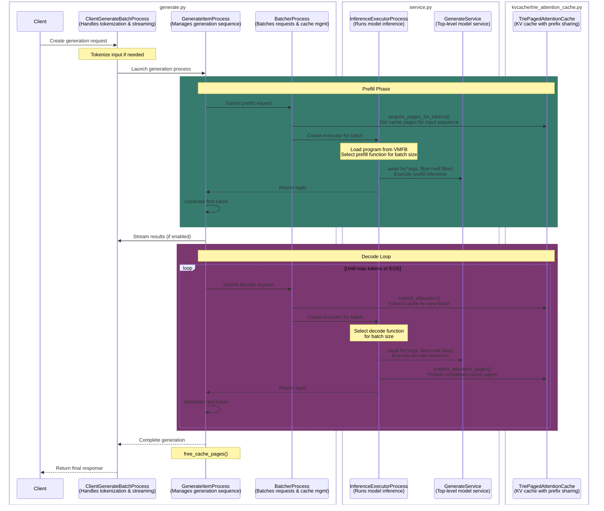

# Shortfin LLM Inference - Architecture Doc

Roughly, this is the lifecycle of a request coming from a client.

`server.py` attaches a fastapi client to `components/service.py`

`service.py` invokes the program loaded from VMFB at the `await fn` line (ctrl+f `await fn` to find it).

Everything in between is documented in this diagram below:

